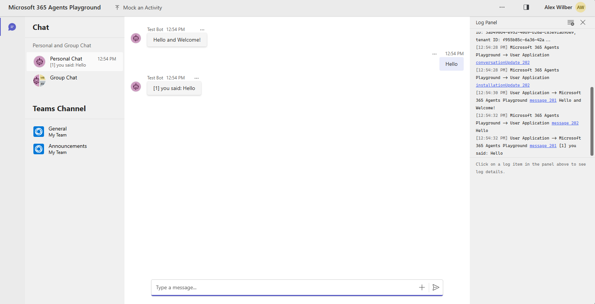

# 🖥️ VM Uptime Request Bot ⚡

<div align="center">


</div>

> 🙋 A Teams bot for requesting a VM be kept up outside normal off-hours, with a full approve/reject flow.

---

## ✨ What it does

- 📝 Type `/request-vm` to get a form (VM name, from date/time in CET, uptime: 4/8/12/24 hours).
- 📨 Submitting sends an **Accept ✅ / Reject ❌** card (with an optional/required note) to a configured approver.
- 🔄 Both the requester's and approver's cards **update live in place** as the request moves Pending → Accepted/Rejected.
- 💾 Requests are persisted in **Azure Table Storage** (defaults to the local Azurite emulator until real Azure access is provisioned).
- 🚧 The actual Azure VM start/stop automation is a later phase — this is only the request/approve/reject/status flow.

This app template is built on top of the [Microsoft Teams SDK](https://aka.ms/teams-ai-library-v2). 🤖

---

## 🚀 Before you can test this

1. 🗄️ **Start Azurite** (local Table Storage emulator) in a separate terminal:
   ```
   npm run azurite
   ```
2. 👤 **Set an approver**: have the person who'll approve requests message the bot once (anything, e.g. `/whoami`) so the bot learns their conversation id, then copy the "AAD object id" it replies with into `APPROVER_AAD_OBJECT_ID` in `env/.env.local` (or `env/.env.playground`).
3. ▶️ Run the bot (see below).

> ⚠️ **Playground limitation**: the M365 Agents Playground simulates a single person chatting with the bot. Proactively notifying a *different* person (the approver) requires a real registered bot identity (Entra app + Bot Framework registration), which Playground's zero-credential mode doesn't have. So in Playground you can build/verify the form, validation, and card rendering 🎨 — but the "deliver this to the approver" step needs either the local F5 debug flow (which does register a real Entra app) or a real deployment. If proactive delivery fails, the request is still saved and the requester is told delivery failed rather than the bot crashing. 🙅

---

## 🏁 Get started

> **📋 Prerequisites**
>
> To run this bot on your local dev machine, you will need:
>
> - 🟢 [Node.js](https://nodejs.org/), supported versions: 22
> - 🧰 [Microsoft 365 Agents Toolkit Visual Studio Code Extension](https://aka.ms/teams-toolkit) version 5.0.0+ or [Microsoft 365 Agents Toolkit CLI](https://aka.ms/teamsfx-toolkit-cli)

> 💻 For local debugging using the CLI, see [Set up your Microsoft 365 Agents Toolkit CLI for local debugging](https://aka.ms/teamsfx-cli-debugging).

1. 🧩 Select the Microsoft 365 Agents Toolkit icon in the VS Code sidebar.
2. ▶️ Press **F5** — pick `Debug in Microsoft Teams` for the full flow (real notifications), or `Debug in Microsoft 365 Agents Playground` for a quick UI-only check.
3. 🌐 Your browser (Playground) or Teams client opens automatically.
4. 👋 Try `/request-vm` and `/whoami`.

🎉 **Congratulations!** You're running a live VM-approval bot.



---

## 📂 What's included

| 📁 Folder    | 📄 Contents                                   |
|--------------|------------------------------------------------|
| `.vscode`    | 🛠️ VSCode files for debugging                  |
| `appPackage` | 📦 Templates for the application manifest       |
| `env`        | 🌱 Environment files                            |
| `infra`      | ☁️ Templates for provisioning Azure resources   |

| 📄 File       | 📄 Contents                                     |
|---------------|---------------------------------------------------|
| `app.ts`      | 🧠 Bot logic: commands, cards, approval flow       |
| `cards.ts`    | 🎴 Adaptive Card builders                          |
| `storage.ts`  | 🗃️ Azure Table Storage access                     |
| `time.ts`     | ⏰ CET timezone validation                          |
| `config.ts`   | ⚙️ Runtime configuration                           |
| `index.ts`    | 🚪 Entry point                                      |

| 📄 Toolkit file             | 📄 Contents                                          |
|------------------------------|----------------------------------------------------------|
| `m365agents.yml`             | 🏗️ Main Microsoft 365 Agents Toolkit project file        |
| `m365agents.local.yml`       | 🖥️ Overrides for local execution and debugging           |
| `m365agents.playground.yml`  | 🎮 Overrides for Microsoft 365 Agents Playground          |

📖 [Full Toolkit guide on GitHub](https://github.com/OfficeDev/TeamsFx/wiki/Teams-Toolkit-Visual-Studio-Code-v5-Guide#overview)

---

## 📚 Extend this bot

- 🌍 [Add or manage the environment](https://learn.microsoft.com/microsoftteams/platform/toolkit/teamsfx-multi-env)
- 🧩 [Create multi-capability app](https://learn.microsoft.com/microsoftteams/platform/toolkit/add-capability)
- 🔐 [Add single sign on to your app](https://learn.microsoft.com/microsoftteams/platform/toolkit/add-single-sign-on)
- 📊 [Access data in Microsoft Graph](https://learn.microsoft.com/microsoftteams/platform/toolkit/teamsfx-sdk#microsoft-graph-scenarios)
- 🔑 [Use an existing Microsoft Entra application](https://learn.microsoft.com/microsoftteams/platform/toolkit/use-existing-aad-app)
- 📝 [Customize the app manifest](https://learn.microsoft.com/microsoftteams/platform/toolkit/teamsfx-preview-and-customize-app-manifest)
- ☁️ Host your app in Azure: [provision cloud resources](https://learn.microsoft.com/microsoftteams/platform/toolkit/provision) & [deploy to cloud](https://learn.microsoft.com/microsoftteams/platform/toolkit/deploy)
- 🤝 [Collaborate on app development](https://learn.microsoft.com/microsoftteams/platform/toolkit/teamsfx-collaboration)
- 🔄 [Set up the CI/CD pipeline](https://learn.microsoft.com/microsoftteams/platform/toolkit/use-cicd-template)
- 🏪 [Publish the app to your organization or the Microsoft app store](https://learn.microsoft.com/microsoftteams/platform/toolkit/publish)
- 💻 [Develop with Microsoft 365 Agents Toolkit CLI](https://aka.ms/teams-toolkit-cli/debug)
- 📱 [Preview the app on mobile clients](https://aka.ms/teamsfx-mobile)
